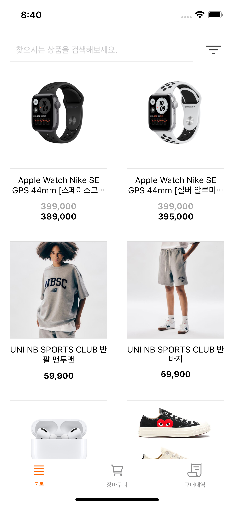
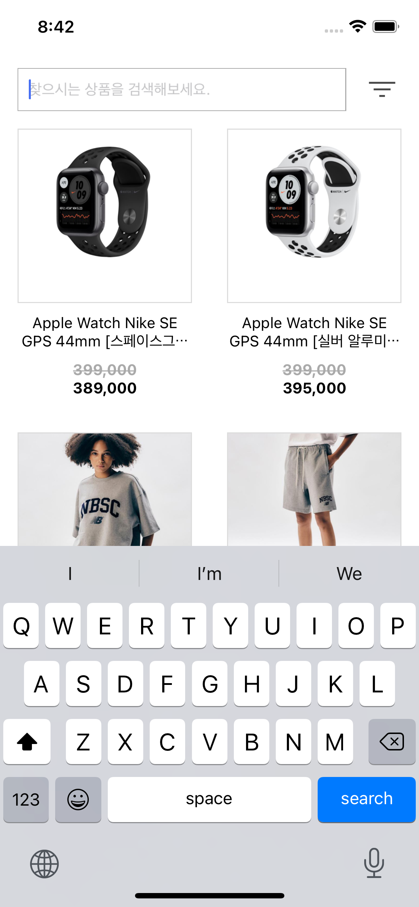
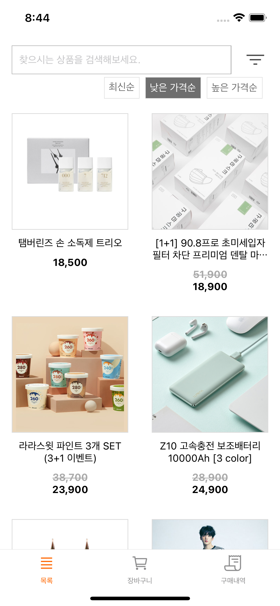
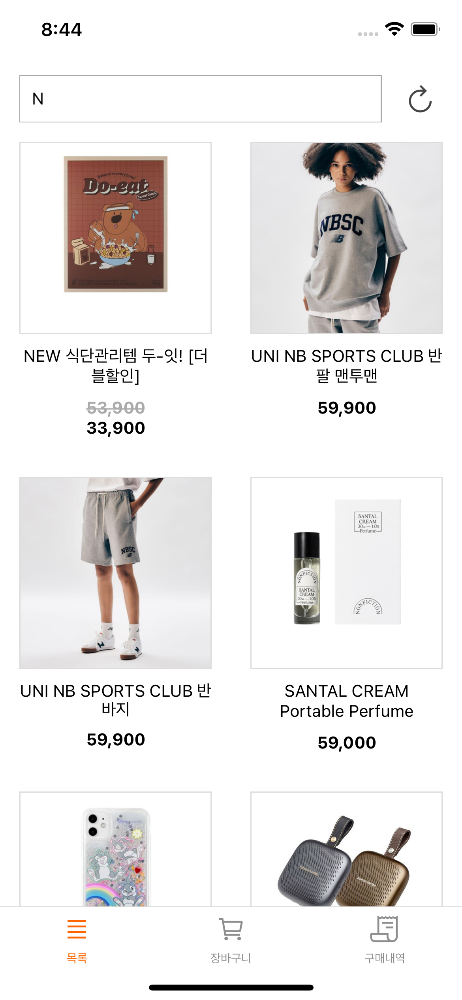
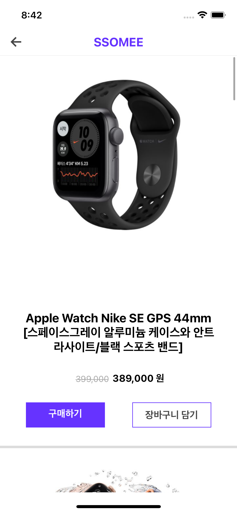
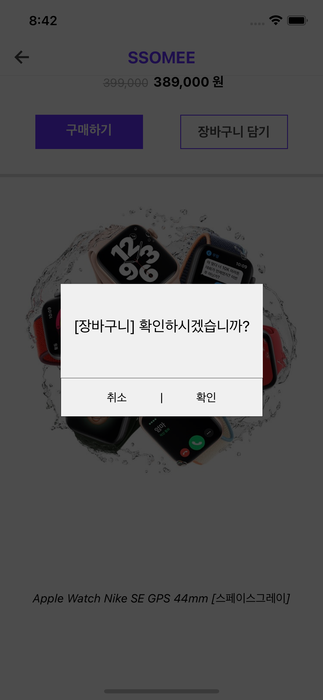
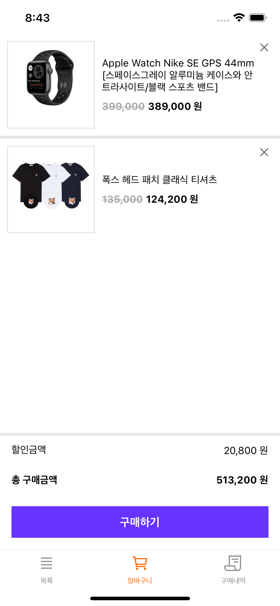
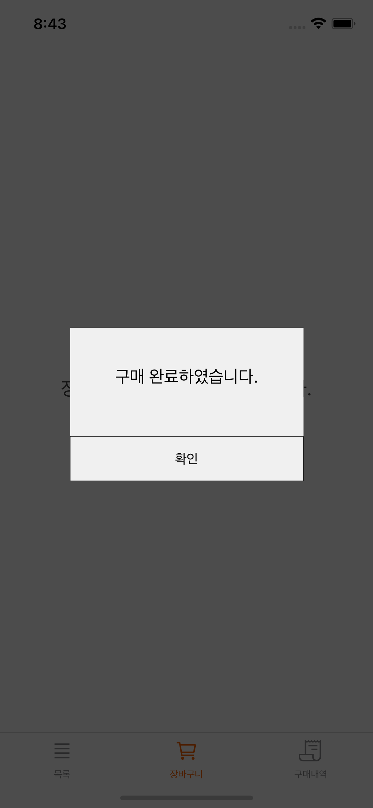
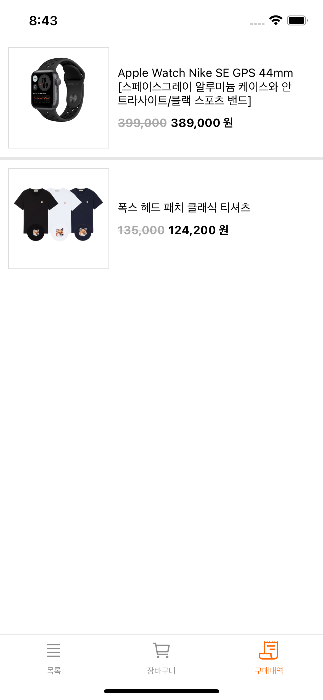

## 소미마켓

### **주요기능**

- 상품 목록
  - 검색 기능
  - 필터(정렬)기능
  - 초기화 기능
- 상세 페이지
  - 구매 및 장바구니 담기 기능
- 장바구니
  - 상품 확인 및 금액 표시
  - 구매 기능
- 구매내역

### **개발 환경**

- React Native 0.64
- React Navigation v5
- 상태관리 : Redux

### **화면별 상세 정보**

1. **상품을 목록에서 확인**
2. **검색을 통해 원하는 상품 찾기**

{: width="40%" } &nbsp;&nbsp;&nbsp;&nbsp;
{: width="40%" }

---

1. **최신순, 낮은 가격순, 높은 가격순으로 정렬 가능**
2. **검색창 오른쪽 리셋 버튼을 통해 검색어를 초기화**

{: width="40%" } &nbsp;&nbsp;&nbsp;&nbsp;
{: width="40%" }

---

1. **목록에서 각 상품을 클릭 시 상세페이지로 이동**

{: width="40%" } &nbsp;&nbsp;&nbsp;&nbsp;
{: width="40%" }

---

1. **상세페이지에서 구매 및 장바구니에 상품 담기**

{: width="40%" } &nbsp;&nbsp;&nbsp;&nbsp;

---

1. **장바구니 페이지에서 상품 및 금액 확인**
2. **장바구니 페이지에서 일괄 구매**

{: width="40%" } &nbsp;&nbsp;&nbsp;&nbsp;
{: width="40%" }

---

1. **구매내역 페이지에서 구매한 상품 확인**

{: width="40%" }
